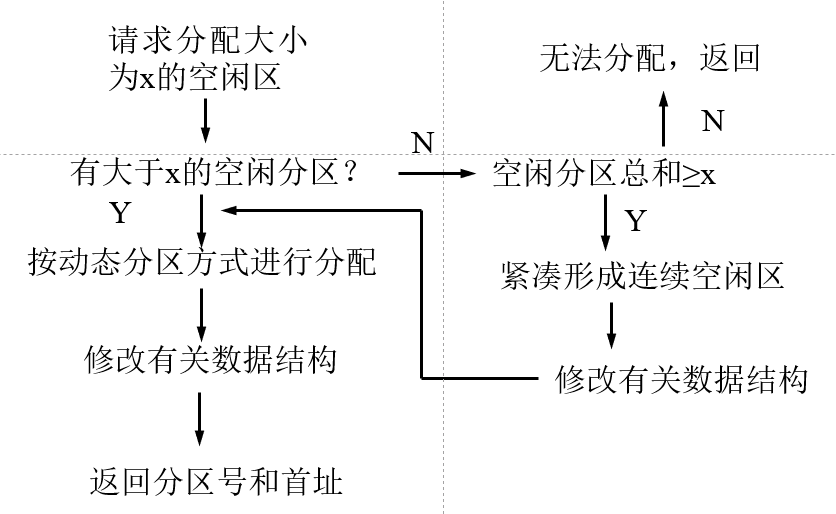

# 存储器管理

## 0. 引入
> 改革开放春风吹满地，人民手头钱多了，但人们没有感到暴富。因为物质需求同时也在增长。

👆存储器管理也是这般。纵然存储空间越来越大，各种软件所需资源也同时膨胀。so 对存储器管理，就是“用好手头的钱，想办法得到更多的钱”。
当然，也要从发展的眼光看存储管理方式的进步~

- 存储器划分：
    系统区（OS用）／用户区（可多个，供用户进程用）

- 功能：
    1. 分配&回收
    2. 抽象&映射（逻辑地址→物理地址）
    3. 内存扩充 （逻辑扩充）
    4. 存储保护

## 1. 基本概念
源程序→可执行程序，一般历经：
> 1）编译 → 2）链接 → 3）装入
### 1.1 程序装入

#### 绝对装入方式
编译时产生**绝对地址**的目标代码，装入该地址
（逻辑地址==绝对地址）

*适用于单道程序*
#### 可重定位装入方式
编译时产生**逻辑地址**的目标代码，装入时进行**地址映射**
- 绝对地址=逻辑地址 + 程序基地址
- 地址变换转入时**一次完成**

👆一次性装入，当程序较大时代码利用率低，装入过多“短时间内”不使用的代码
#### 动态运行时装入方式
装入内存时不地址变换，在程序执行过程中进行地址变换
- 需硬件支持
- 可**部分**装入
- 可将程序分配到**不连续**的内存

### 1.2 程序链接
- **静态链接**：
    运行前装配为完整装入模块

- **装入时动态链接**：
    目标模块在装入内存时**边装入边链接**。
    特点：便于软件版本的修改和更新，便于目标模块的共享
    缺点：不可预知要运行的模块。导致每次装入模块都**相同**（保证完整、可用的妥协）

- **运行时动态链接**：
    **执行**过程中，若发现被调用模块尚未装入内存，OS才进行寻找、装入、链接该模块
    特点：加快程序装入，节省内存。


### 1.3 内存保护

#### 界限保护
1. 上下界寄存器
2. 基址、限长寄存器

#### 访问方式保护
锁与钥匙：
存储块： 分配专属保护键（block）
进程： 赋予保护键（key）

#### 环保护
划分**特权级**
（OS kernel：0级——最高级）

## 2. 单一连续分配
- 特点:
    **静态分配**，简单，单用户、单任务

- 来由：
    早期微处理机内存有限，处理能力差，无法支持时分复用

- 缺点：
    只支持单道作业，资源利用率低

## 3. 分区存储管理
terminology：
`内部碎片`：Internal Fragment，分配给作业的存储空间中未被利用的部分
`外部碎片`：External Fragment，系统中无法利用的小存储块
### 3.1 固定分区
- what
    内存空间划分为**大小不等**若干区域供程序装入运行，位置与大小**运行期间不变**
- data structure
    建立`分区说明表`（结构体数组）
    ```
    struct regions_info{
        int no;          //分区号
        int size;        //分区大小
        int beginAddress;//起始地址
        bool status;     //状态：是否分配
    }
    ```
- disadvantages:
    为保证程序可装入，$RegionSize >= ProgrammeSize$
    因为事先固定分区大小，对程序“定制性”低，导致**分区内**存在`内部碎片`，内存利用率低

### 3.2 动态分区管理
- what
    作业装入内存时，根据其大小**动态*建立分区

- data structure
    - 空闲分区表（不合适）
    - 空闲分区链

but！随分区的建立与释放，**分区间**产生`外部碎片`，需要设计**动态分区分配与回收机制**

#### 分区分配算法
- **首次适应算法**
    first fit
    分区要求：地址递增 
    策略：每次作业要求，从头找第一个满足大小的分区
    特点：
        1. 保留高地址的**大空闲区**
        2. 每次查找从头开始→查找开销大
        3. 低地址不断被划分→产生许多细小的空闲分区
        
- **循环首次适应**
    first fit演变。新的作业要求，从上次查找的空闲分区下一个开始
    特点：空间**利用均衡**/缺少大分区
- **最佳适应**
    best fit
    分区要求：容量递增
    策略：找第一个合适大小的空闲区
    特点：
        1. 所划分的空闲分区大小与作业要求**最为接近**
        2. 留下较多难利用的小空闲分区
- **最坏适应**
    worst fit
    分区要求：容量递减
    策略：比对最大空闲分区，满足作业要求则划分，否则失败
    特点：
        1. **分配迅速**，1次比对即决定能否分配
        2. 对大空闲分区不断划分，常不能满足**大作业的申请**

#### 分区回收
与现有空闲分区关系：（通过对首地址、分区大小运算判断）
    1. 上相邻
    2. 下相邻
    3. 上下相邻
    4. 不相邻
    > `首次适应/循环首次适应`不用调整`空闲分区链`
    >  `最好/最坏适应` 需要按新空闲分区大小调整`空闲分区链`

#### 可重定位分区分配
动态分区，会产生`外部碎片`，需要对这些存储快进行整理、利用
- 拼接 Compaction
    技术难点：
    > 1. 需要`动态重定位`技术， 记录拼接后的**位置**
    > 2. 移动到哪？ 评估碎片移动到不同位置的开销
    > 3. 何时移动？多久一次？ 高频→增添系统开销；低频→内存可能紧张

- 算法描述
（动态分区+拼接尔尔——)


### 4. 伙伴系统 buddy system
Elegant！二进制的舞蹈！Linux🐂🍺

- 算法描述
$$Initial Space:2^m$$
$$Requested Space：n ,which (2^{i-1}\leq n\leq 2^i)$$
```pseudo
if system exist size(i) block
    dispatch it to application
else{
    if we have size(j) block, j>i{
        do{
            equally divide space,
            j--,
            we get two size (j-1) block
        }when(j==i)
        dispatch the generated size(i) block to application
    }
    else
        request failed
} 
``` 