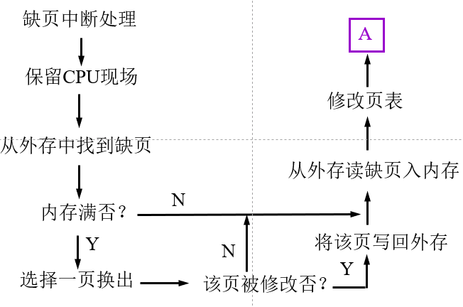
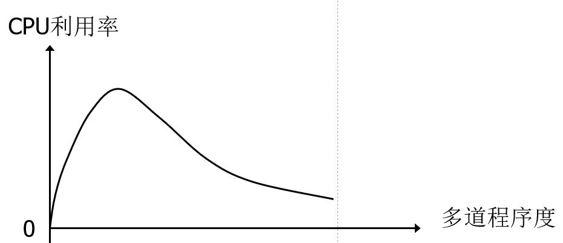

# 虚拟存储器
## 0. 引入
此前存储管理方式，都需要将作业**全部**装入内存，有如下缺陷：
1. 作业过大，内存无法装入
2. 作业的许多信息驻留主存，但**暂时**不用（Ex. 错误处理程序）

## 1. 虚存概念
- 理论基础
**局部性原理**（空间&时间）
- 目的
扩大主存（时间换空间）
- 实质
把程序**存在**的地址空间（抽象上，有一个大的“虚拟存储器”）和**运行**是存放程序的存储空间分离
- 特征
离散性：不连续内存分配
多次性：一个作业分多次装入内存
对换性：允许运行中换进换出
虚拟性：逻辑上扩充内存
- 实现的物理基础
    1. 充足外存（e.g. 磁盘必须要能装入全部作业）
    2. 一定内存（至少能运行作业的部分）
    3. 地址变换机构

Q&A
Q：虚存可以无限扩大吗，受到什么的制约？
A：不能。
> 1. 受限于外存容量
> 2. 受限于**地址结构**（不能超出寻址空间的范围）

## 2. 请求分页存储管理
> 在分页存储管理基础增加**缺页处理**（请求调页、页面置换）

### 2.1 页表
增加相关位来记录页的状态。

页号|物理块号|存在位|访问字段|修改位|外存地址
---|---|---|---|---|---|---|

- 访问字段：记录页被访问次数或未被访问时长👉配合替换策略实现

### 2.2 中断处理过程

### 2.3 页面分配和置换策略
#### 1. 思考进程运行所需物理块数下界
#### 2. 页面分配策略
1. **固定分配局部置换**
每个进程分配的物理块数量静态，只对该进程拥有的物理块进行置换
2. **可变分配全局替换**
most practical 
    > 先为系统中的每个进程分配一定数量的物理块，操作系统本身也保持一个**空闲物理块队列**。当某进程发生缺页时，由系统从空闲物理块队列中取出一个物理块分配给该进程；当空闲物理块队列中的物理块用完时，操作系统才从内存中选择一页调出，该页可以是系统中任何一个进程的页面
    (UNIX使用，详情自查)
3. **可变分配局部置换**
性能好，实现复杂
### 2.4 页面置换算法
#### 1. 最佳置换 Optimal Replacement Algorithm
- def：从内存中选择**未来访问时间最晚**的页进行置换
👆
理想且直观，but无法实现
因为页未来访问顺序难以预测

#### 2. 先进先出 First-In-First-Out
特点:
1. 实现简单
2. 适合线性
3. 循环结构，若块数不足，性能下降
4. [Belady现象](https://www.geeksforgeeks.org/operating-system-beladys-anomaly/)
 > 增加块数，对于性能的提升：道路是曲折的，前途是光明的😂

 #### 3. 最近最久未使用 Least Recently Used
 - 性能优秀但实现开销大
 - 实现
    1. 链表法
    两端分别为刚使用过的页，与最近最久未使用的页
    每次页面访问，修改链表顺序
    2. 计数器法
    （页较多时，开销大）

#### 4. 其他-对FIFO的改进
1. 二次机会 Second-Chance
2. 简单时钟 Clock
3. 改进时钟（增加修改位标记）
4. 页面缓冲 Page-Buffering
    > *概述*：FIFO选择被置换页面，被选择的页面转入**页面链表**暂存一定时间。若随后又再次需要调入该页面，则优先从**页面链表**中取，以减少磁盘**IO次数**。
    > *链表*：分为——未修改/已修改

### 2.5 页面大小与缺页率
#### 1. 页面大小权衡
- 页内碎片：页面小，碎片小
- 内外存传输时间：传输时间与页面大小相关度低。页面大，单位数据传输率高
- 页表大小：页面小，页表大，开销大

#### 2. 页面大小分析

#### 3. 缺页率因素
- 主存块数
- 页面大小
- 页面置换算法
- 程序特性

### 2.6 工作集理论和抖动
#### 1. 工作集
**Working-Set**
指在某段时间间隔$\Delta$里，进程实际访问的页面集合，具体地说便是把某进程在时间$t-\Delta$到$t$之间所访问的页面集合记为$w(t,\Delta)$，把变量$\Delta$称为工作集窗口尺寸。
#### 2. 抖动
- def：
    运行进程的**大部分时间**都用于页面的**换入/换出**，而几乎不能完成任何有效的工作的状态

程序道数不能盲目增加，否则由于内存不足引发抖动。
 

- 原因
    1. 进程分配的物理块太少
    2. 置换算法选择不当
    3. 全局置换使抖动传播

- 抖动监测
思路：设置threshold，监测缺页率、时间等

    1. **全局范围技术**
    2. L=S准则
    3. 利用缺页率发现抖动
    4. 平均缺页频率

- 抖动预防与解除
    1. **挂起**（减少运行道数，释放空间）
    > 如何选择进程？
        1. 优先级最低
        2.发生缺页中断的进程
        3. 最后被激活的进程
        4. 最大的进程

    2. 应用*工作集模型*，分配物理块
    3. 采用局部置换策略👈将抖动限制在单个进程中

## 3. 请求分段存储管理
