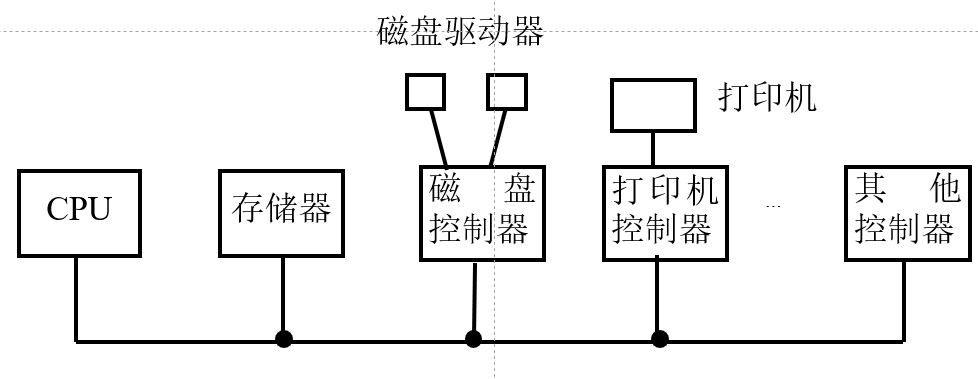
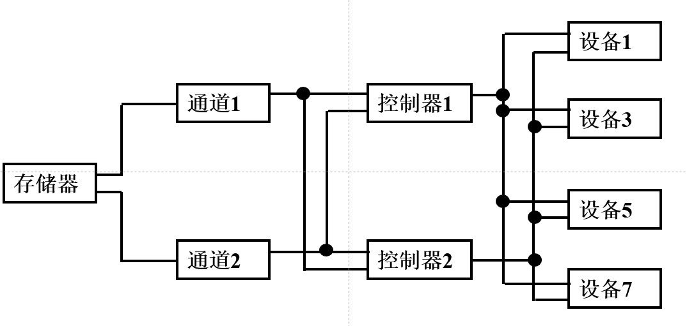
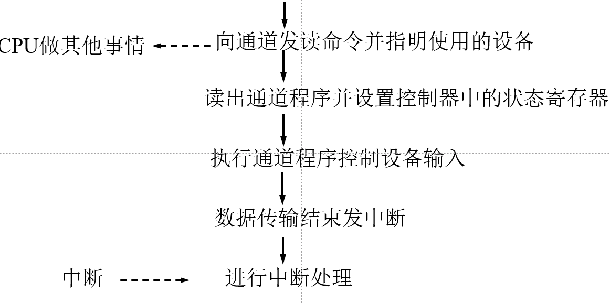
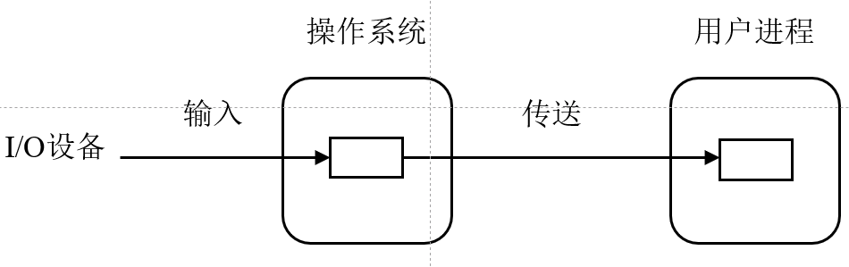
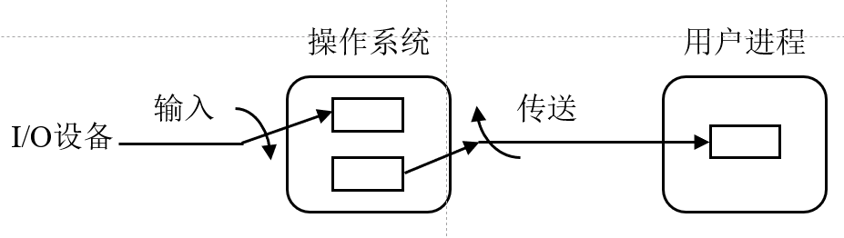
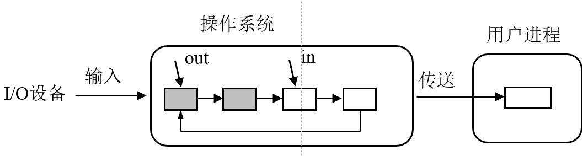
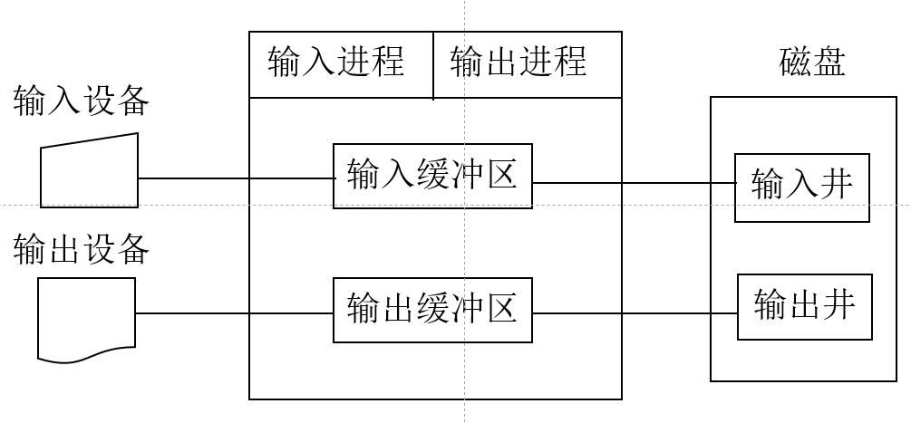
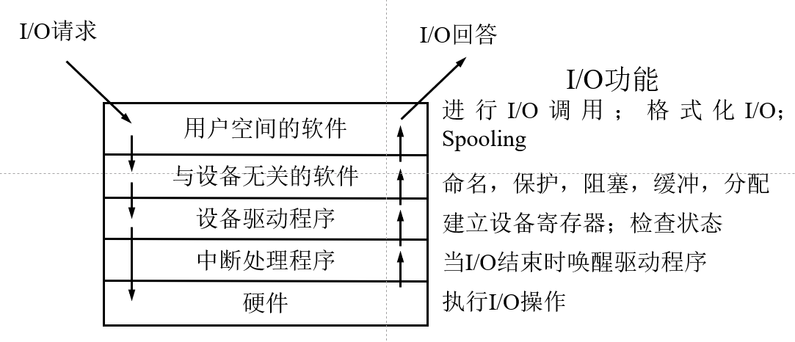

# 设备管理
> 常用的设备，可感知的诸如鼠标、键盘、显示器、磁盘；
> 还有那些不易发觉的，如**网卡、时钟**等。
> 操作系统大小的增长，一部分源于各种设备的出现——需要对应的接口与管理（**driver驱动**）
> 新设备的出现，需要厂商提供操作系统支持的驱动。

## 1. 概述
### 1.1 分类
1. 按特性
    - 存储（e.g.磁盘、磁带）
    - I/O设备
2. 按共享属性
    - 独占设备
        > 一段时间内，只允许**一个用户**
    - 共享设备
        > **一段时间**允许多个进程使用（e.g. 外存)
    - 虚拟设备
        > 改造独占设备为**逻辑虚拟设备**。
3. 按**信息交换单位**
    - 块设备（需要**寻址**）
    - 字符设备（无需寻址）

### 1.2 任务&功能
- 任务：
可用：1. 响应用户设备请求 2. 分配设备
好用：1. 提高设备利用率 2.方便用户使用

- 功能：
    1. 设备分配（通道-控制器-设备）
    2. 设备处理
    3. 缓冲管理（缓和CPU、I/O速度不匹配的矛盾）
    4. 设备独立性（逻辑设备**映射为**物理设备）

### 1.3 设备控制器&通道
#### 设备控制器
def：
功能：
1. 识别、接受CPU命令
2. 用数据寄存器、显存等实现**数据交换**
3. 用状态寄存器向CPU提供设备状态查询
4. 地址识别

#### I/O通道 channel
仍是**处理机**
- 分类
    1. 字节多路（低速、共享）
    2. 数据选择（高速，独占）
    3. 数据多路

### 1.4 I/O系统结构
1. 微型机
**总线I/O系统结构**（PCI标准）
> 微机设备不多，总线能满足需求。（主板上总线+插槽）
“车辆不多，一条大马路足以。”

2. 主机型
**使用I/O通道**（通道价格贵哦，无法布置许多）
- 单通道（存在**瓶颈**现象）
- 多通道

## 2. I/O控制方式
### 2.1 程序直接控制
即**轮询**
早期计算机无中断机构，采用轮询。现今计算机向下兼容，仍可轮询。此外，部分简单嵌入式系统也使用轮询。
### 2.2 中断控制
以**字节**为单位中断CPU
> 由设备提请求👉提高CPU与设备**并行**工作程度

适合**字符**设备
> 块设备数据传输较快。响应中断时间等于甚至大于其字节传输的速度
### 2.3 DMA控制
思想：开辟直接的数据交换通路，减少中断。
适用于**块设备**数据传输
register要求：
1. CR 命令/状态寄存器
2. MAR 内存地址寄存器：内存起始地址
3. DR 数据寄存器：data
4. DC 数据计数器：IO字节数

### 2.4 通道控制

## 3. 中断
### 3.1 名词
- 断点
- 恢复点
- 现场
- 程序状态字
- 中断源/中断请求/中断响应
- 开/关中断，屏蔽中断
### 3.2 处理过程
1. 现场保护
2. 执行对应中断处理程序
3. 恢复现场

## 4.缓冲
### 4.1 引入
- 引入原因
    1. 缓和速度不匹配矛盾
    2. 提高并行操作程度
    3. 减少中断频率
        >无缓冲，产生1字节，发1中断
        有缓冲，缓冲区(e.g. 1024byte)满，发1中断
- 实现方法
    - hardware：增加Registers，成本高
    - software：开辟内存区域

### 4.2 单缓冲

为何能提升效率？👉process & IO device，提升了**并行**程度
Ex.
> 设IO直接输入给user process所需时间：$T_1$
buffer传送给user process所需时间：$T_2$
用户进程运算所需时间$T_3$
$$T_3>T_1>T_2$$
当IO执行$N$次时，有：
$$N*(T_1+T_3)>N*T_3+m*T_2,m<<N$$

### 4.3 双缓冲

### 4.4 循环缓冲

- 单、双缓冲即循环缓冲的**特例**
- 内存利用率不高。进程多时创建多条循环缓冲区，开销大

### 4.5 缓冲池
当下，常使用**公共缓冲池**。由多个缓冲区组成，供多个进程**共享**，能输入又能输出。 
**内含**：
1. 缓冲队列
    - 空缓冲队列
    - 输入队列（装**满**的输入缓冲区
    - 输出队列（装**满**的输出缓冲区
2. 工作缓冲区
    - 收容输入数据
    - 提取输入数据
    - 收容输出数据
    - 提取输出数据
    👆👆👆
    提取完后，挂到空缓冲队列
    收容完后，挂到对应I/O队列

### 5. 设备分配
- data structure
    - 设备控制表`DCT`（描述设备信息，e.g. 
    - 控制器控制表`COCT` （状态、名称、空闲与否
    - 通道控制表`CHDT`
    - 设备表（一个系统仅一个)`SDT`

#### 5.1 分配
考虑：
1. 设备使用性质（独占/共享/`虚拟`)
> 虚拟：设备本身虽是独占设备，SPOOLing技术处理后改造成虚拟设备
2. 分配算法
    - 先来先服务
    - 高优先级
3. 安全性
保证不发生进程死锁。（review）
    - `静态分配`：无死锁，一次性全部分配。低效。
    - `动态分配`：按需分配
4. 独立性
进行**逻辑设备**的抽象。
实现：可用`逻辑设备表`👈你爱叫啥叫啥，反正是实现一个**映射**

### 5.3 设备分配
分配设备 --> 分配控制器 --> 分配通道

#### 5.4 SPOOLING 系统
> background：
独占设备数量少，许多进程因等待其分配而阻塞

Simultaneous Peripheral Operations On-Line
独占设备 -->改造--> 共享设备

- 组成：
    - `输入/输出井`
    - 输入/输出缓冲区
    - 输入/输出进程

### 6. I/O软件层次结构

