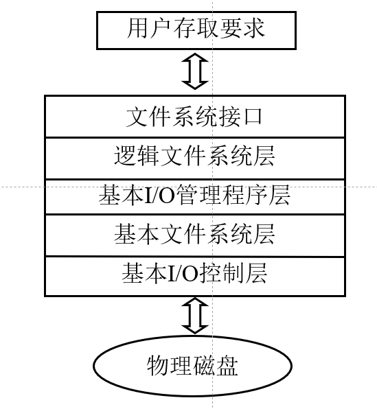
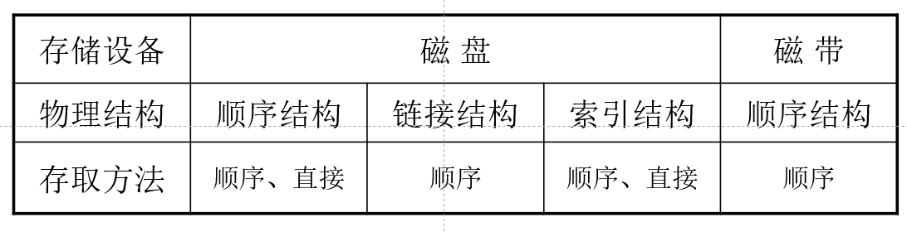
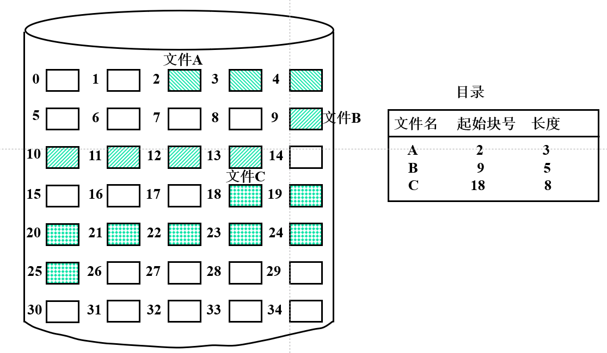
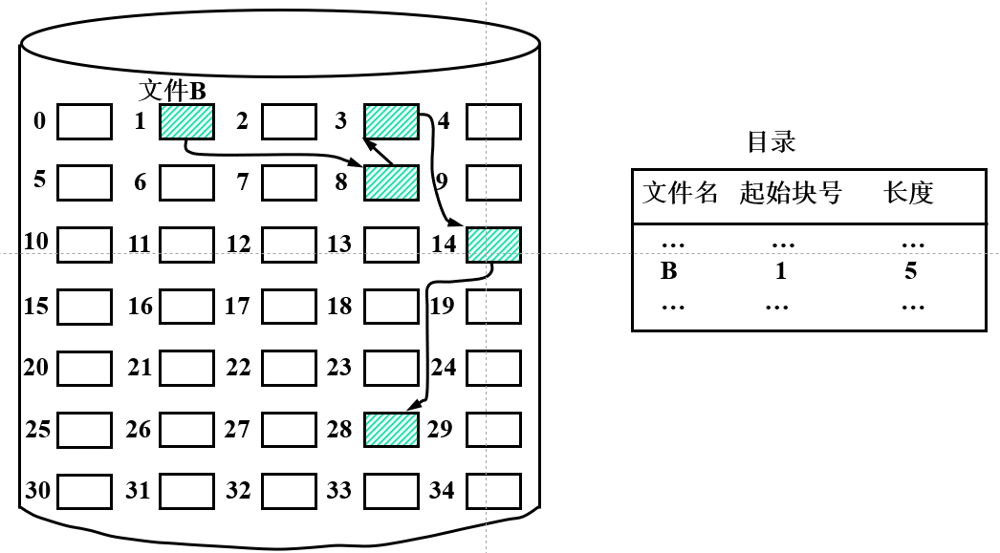
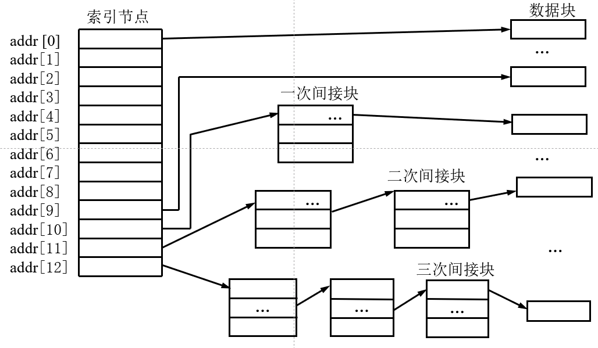

# 文件管理

## 0. 引入
- 何为软件？从某种抽象的角度，它们都是**文件**。无论是**OS**还是**应用软件**。
- 文件的物理存储位置，在**外存**。
- 文件为何是OS实现的**高度抽象**？
用户对于文件的操作（增删改查等），只需要提供**文件名**即可。

## 1. 文件系统的概念
### 1，1 文件和文件系统
1. 文件def
2. 文件系统
    - 主要功能
        > 实现文件的按名存取
    为用户提供接口
    实施对文件和目录的管理
    文件存储空间的分配及回收
    文件的共享及保护
    （review：为什么要共享👉1. 提高空间利用率 2. 进程通信要求 3. 减少版本冲突）
    - 层次结构
    通过合理分层实现抽象
    

### 1.2 文件分类
> 我们印象中文件是怎么分类哒？Windows是依靠**后缀名**进行分类的。
but也有不一样的方式，*Linux*就不靠后缀名。

- 按用途
系统/库/用户
- 保护级别
只读/读写/执行/不保护
- 信息流
输入（e.g. 键盘文件）/输出（e.g. 打印机文件）/输入输出
- 数据形式
源/目标/可执行

**Unix**文件分类小览：
不依靠后缀名。

## 2. 文件结构与存储设备
### 2.1 文件逻辑结构
分类：**记录式文件** / **流式文件**
##### 记录式文件的组织形式（对比**DB数据库**）
- **顺序文件**：记录按关键字的大小排列。记录定长。
- **索引文件**：为文件设置一个索引表，每个记录有表项，存放记录的存放地址及长度。
- **索引顺序文件**：先**分组**，组间索引，组内顺序。

### 2.2 文件物理结构
#### 1. 顺序结构
def：将信息存放在外存**连续**的物理块中。

特点：
- 顺序存取速度较快
    > 信息存放在磁盘块相近磁道、扇区，磁头移动次数、距离少
- 对等长记录文件支持随机访问
- 要求连续存放，产生碎片
- 不利于文件的动态扩充

应用：作为**临时交换区**的结构

#### 2. 链接结构
def：将信息存放在外存**不连续**物理块中，且在物理块中设置指向下一个物理块的**指针**

特点：
- 可解决碎片问题，便于文件动态增长
- 只能顺序访问（类似**单链表**），查找效率较低，指针占用存储空间

#### 3. 索引结构
def：信息存放于外存的若干个物理块中，并为每个文件建立**索引表**，其中的每个表目存放文件信息所在的逻辑块号和与之对应的物理块号。

特点：
- 顺序/随机访问皆可
- 增加了存储空间开销
- 要两次访问外存

### 2.3 存取方法
1. 顺序存取
2. 随机存取
3. 按键存取

### 2.4 文件的存储设备
#### 1. 设备
- 磁带
**顺序存取**
- 磁盘
**直接存取**
访问时间：
    > **寻道时间**（最耗时）+旋转延迟时间（找扇区）+传输时间 

#### 2. 关系

#### 3. 磁道调度算法
> 现在的磁盘调度，常写在**磁盘驱动**程序中（第一次使用移动硬盘时就会安装，记得不）
- FCFS 先来先服务
- SSTF 最短寻道时间优先
存在**饥饿**现象
- SCAN 扫描（电梯调度算法）
在磁头当前移动方向上选择与当前磁头所在磁道距离最近的请求作为下一次服务的对象
**对两端磁道不公平**
- CSCAN 循环扫描
磁头**单向移动**，即到头就返回起点，返回过程中不服务（👈存在周期空闲，损失效率）
- N-Step-SCAN
解决问题：**磁臂粘着**。若多个进程反复请求对某一磁道的访问，则磁臂可能停留在某处不动。
思想：SCAN与FCFS的结合
描述：将磁盘请求队列分成若干个长度为N的子队列，按FCFS依次处理子队列，处理每个队列时按SCAN算法进行，一个队列处理完后，再处理其他队列。

#### 4. 磁盘容错技术
**分级**：
1. SFT-1（低级-防止磁盘表面部分故障）：
    - 双份目录、双份文件分配表
    - 写后读校验
    - 热修复重定向
        > “假装没有故障发生”。将写出错块的数据重定向到备用块，逻辑上给用户反馈的是成功写入出错块。
        仅适合处理少量缺陷。若坏块过多，采用过多热修复块，导致磁盘寻道效率大幅下降

2. SFT-2（中级-防磁盘驱动器发生故障）：
    - 磁盘镜像（控制器\*1+驱动器\*2）
    - 磁盘双工（控制器\*2+驱动器\*2）
3. SFT-3（高级-文件服务器镜像）

**RAID**
——Redundant Arrays of Independent Disks

## 3. 文件存储空间的分配与管理
## 3.1 分配
1. 连续分配

- 顺序访问容易且速度快
- 目录中文件存储位置信息简单；
- 容易产生碎片，需要定期对磁盘空间进行整理。

2. 链接分配
以**扇区**/**区段**为单位分配

- 消除了碎片，不需要压缩
- 不支持随机存取
- 链接指针要占用磁盘空间

> **文件分配表FAT**是以链接方式存储文件的系统中记录磁盘分配和跟踪空白盘块的数据结构

3. 索引分配
系统为每个文件分配一个索引块，索引块中存放索引表，索引表中的每个表项对应分配给文件的一个物理块。

若文件过大，一个索引块存不下→**多级索引**
then，索引分配的泛化形态——**混合索引**来了
