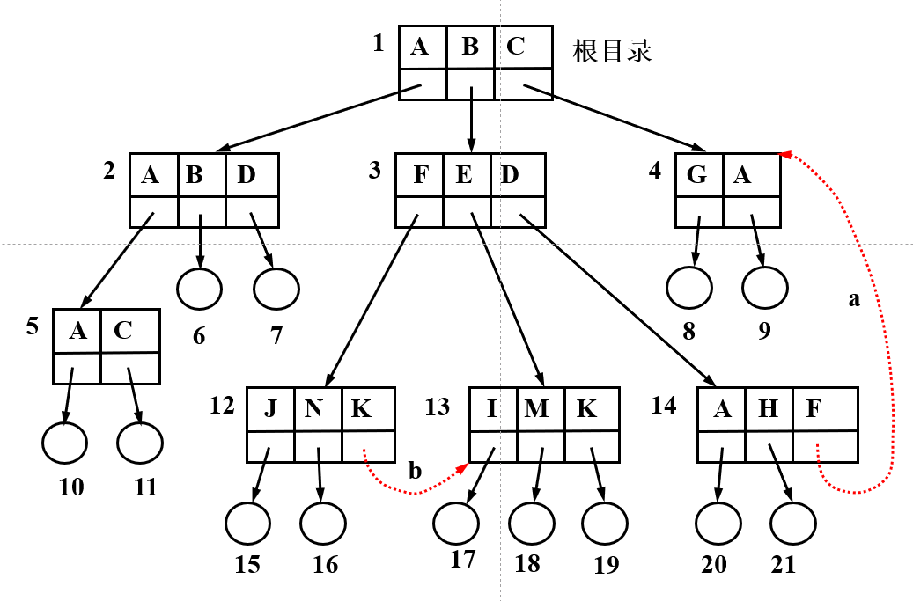
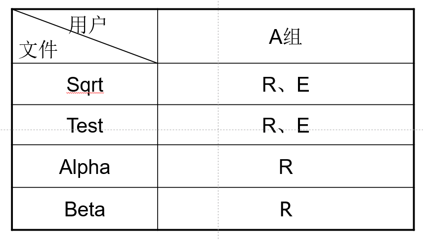

# 文件管理

## 0. 引入
- 何为软件？从某种抽象的角度，它们都是**文件**。无论是**OS**还是**应用软件**。
- 文件的物理存储位置，在**外存**。
- 文件为何是OS实现的**高度抽象**？
用户对于文件的操作（增删改查等），只需要提供**文件名**即可。

## 1. 文件系统的概念
### 1，1 文件和文件系统
1. 文件def
2. 文件系统
    - 主要功能
        > 实现文件的按名存取
    为用户提供接口
    实施对文件和目录的管理
    文件存储空间的分配及回收
    文件的共享及保护
    （review：为什么要共享👉1. 提高空间利用率 2. 进程通信要求 3. 减少版本冲突）
    - 层次结构
    通过合理分层实现抽象
    

### 1.2 文件分类
> 我们印象中文件是怎么分类哒？Windows是依靠**后缀名**进行分类的。
but也有不一样的方式，*Linux*就不靠后缀名。

- 按用途
系统/库/用户
- 保护级别
只读/读写/执行/不保护
- 信息流
输入（e.g. 键盘文件）/输出（e.g. 打印机文件）/输入输出
- 数据形式
源/目标/可执行

**Unix**文件分类小览：
不依靠后缀名。

## 2. 文件结构与存储设备
### 2.1 文件逻辑结构
分类：**记录式文件** / **流式文件**
##### 记录式文件的组织形式（对比**DB数据库**）
- **顺序文件**：记录按关键字的大小排列。记录定长。
- **索引文件**：为文件设置一个索引表，每个记录有表项，存放记录的存放地址及长度。
- **索引顺序文件**：先**分组**，组间索引，组内顺序。

### 2.2 文件物理结构
#### 1. 顺序结构
def：将信息存放在外存**连续**的物理块中。

特点：
- 顺序存取速度较快
    > 信息存放在磁盘块相近磁道、扇区，磁头移动次数、距离少
- 对等长记录文件支持随机访问
- 要求连续存放，产生碎片
- 不利于文件的动态扩充

应用：作为**临时交换区**的结构

#### 2. 链接结构
def：将信息存放在外存**不连续**物理块中，且在物理块中设置指向下一个物理块的**指针**

特点：
- 可解决碎片问题，便于文件动态增长
- 只能顺序访问（类似**单链表**），查找效率较低，指针占用存储空间

#### 3. 索引结构
def：信息存放于外存的若干个物理块中，并为每个文件建立**索引表**，其中的每个表目存放文件信息所在的逻辑块号和与之对应的物理块号。

特点：
- 顺序/随机访问皆可
- 增加了存储空间开销
- 要两次访问外存

### 2.3 存取方法
1. 顺序存取
2. 随机存取
3. 按键存取

### 2.4 文件的存储设备
#### 1. 设备
- 磁带
**顺序存取**
- 磁盘
**直接存取**
访问时间：
    > **寻道时间**（最耗时）+旋转延迟时间（找扇区）+传输时间 

#### 2. 关系

#### 3. 磁道调度算法
> 现在的磁盘调度，常写在**磁盘驱动**程序中（第一次使用移动硬盘时就会安装，记得不）
- FCFS 先来先服务
- SSTF 最短寻道时间优先
存在**饥饿**现象
- SCAN 扫描（电梯调度算法）
在磁头当前移动方向上选择与当前磁头所在磁道距离最近的请求作为下一次服务的对象
**对两端磁道不公平**
- CSCAN 循环扫描
磁头**单向移动**，即到头就返回起点，返回过程中不服务（👈存在周期空闲，损失效率）
- N-Step-SCAN
解决问题：**磁臂粘着**。若多个进程反复请求对某一磁道的访问，则磁臂可能停留在某处不动。
思想：SCAN与FCFS的结合
描述：将磁盘请求队列分成若干个长度为N的子队列，按FCFS依次处理子队列，处理每个队列时按SCAN算法进行，一个队列处理完后，再处理其他队列。

#### 4. 磁盘容错技术
**分级**：
1. SFT-1（低级-防止磁盘表面部分故障）：
    - 双份目录、双份文件分配表
    - 写后读校验
    - 热修复重定向
        > “假装没有故障发生”。将写出错块的数据重定向到备用块，逻辑上给用户反馈的是成功写入出错块。
        仅适合处理少量缺陷。若坏块过多，采用过多热修复块，导致磁盘寻道效率大幅下降

2. SFT-2（中级-防磁盘驱动器发生故障）：
    - 磁盘镜像（控制器\*1+驱动器\*2）
    - 磁盘双工（控制器\*2+驱动器\*2）
3. SFT-3（高级-文件服务器镜像）

**RAID**
——Redundant Arrays of Independent Disks

## 3. 文件存储空间的分配与管理
### 3.1 分配
1. **连续分配**

- 顺序访问容易且速度快
- 目录中文件存储位置信息简单；
- 容易产生碎片，需要定期对磁盘空间进行整理。

2. **链接分配**
以**扇区**/**区段**为单位分配

- 消除了碎片，不需要压缩
- 不支持随机存取
- 链接指针要占用磁盘空间

> **文件分配表FAT**：以链接方式存储文件的系统中**记录**磁盘分配和跟踪空白盘块的**数据结构**

3. **索引分配**
系统为每个文件分配一个**索引块**，索引块中存放**索引表**，索引表中的每个表项（索引结点）对应分配给文件的一个物理块。

若文件过大，一个索引块存不下.直接增加索引块大小，小文件的索引块又造成了空间浪费，怎么办？
→**多级索引**
then，索引分配的泛化形态——**混合索引**来了

> *Unix* 就这样实现哦，固定索引块大小，混合索引。**时间换空间**

### 3.2 空间存储空间管理
`空闲文件`:连续空闲区
#### 1. 空闲文件目录
所有空闲文件建立一个目录
特点：
- 类似内存动态分区
- 只适用于少量空闲文件，否则空闲目录变大导致其效率下降
- 仅适用连续文件。

#### 2. 空闲块链
所有空闲块链接起来，串成单链表形式。
↑↑↑
实现简单，维护链表（增加、删除操作）开销大

改进：
**成组链接法**（又是你，**UNIX**）
将若干个空闲盘块划归一组，将每组中的所有盘块号存放在其前一组的第一个空闲盘块号指示的盘块中，第一组存放空闲盘块号的盘块称为`超级块`。
分配：
> 1. 首先将超级块空闲盘块号表中下一个可用盘块分配出去；
> 2. 如果该组已无除`超级块`外其他空闲盘块，则先将`超级块`中的内容读入超级块空闲盘块号表中，然后才将该盘块分配出去
> （语言贼乏力，看图吧）
> 

优势：
- 本组空闲盘块号信息滞留内存，分配、回收空闲块效率高

劣势：
- 无法撤销删除。盘块回收后空间可能被用于记录空闲盘块号，被修改

#### 3. bitmap
`bitmap`：用一个二进制位描述盘块使用状态。
> 内存中使用较多。外存管理少用。
因为（1）外存空间较大，bitmap开销依旧大（2）磁盘可能损坏，带来第三种状态，一个二进制位无法描述

## 4. 文件目录管理
### 4.1 文件目录
文件组成：
1. `文件控制块`
> 至少包括如下信息：
> - 文件名
> - 文件类型
> - 文件结构：说明文件的逻辑结构和物理结构。
> - 理位置：指示文件在外存上的存储位置。包括设备名、存储地址及文件长度等。
> - 存取权限。
> - 管理信息：包括文件建立的日期及时间、上次存取日期及时间、当前文件使用状态信息
2. `文件体`

`目录`：文件控制块的集合。即文件控制块是一个目录项

目录功能：
1. 实现“按名存取”
2. 提高检索速度
3. 允许文件同名：不同目录下的文件可以使用相同名字。
4. 允许文件共享

### 4.2 单级目录结构
### 4.3 二级目录结构
### 4.4 多级目录结构
### 4.5 图形目录结构

## 5. 文件共享与文件管理的安全性
### 5.1 文件共享
#### 1. 早期方法
1. **绕道法**
    > 每个用户在当前目录下工作，用户对所有文件的访问都相对于当前目录进行。(给出访问路径)
    
    绕路，多次读外存，慢

2. **链接法**
    > 将一个目录中的链指针直接指向被共享文件所在的目录。
    文件说明中增加“**连访属性**”和“**用户计数**”两项
    

    问题：
    若目录中包含文件的**物理地址**，则链接文件的物理地址复制到K目录中。但若随后通过K或I增加内容，**新**数据块将只会出现在进行添加操作的目录中，对其他目录不可见的，致使新增加部分的内容不能被共享。

3. **基本文件目录表法**
    > 文件目录=基本文件目录表BFD+符号文件目录表SFD
    
 
 #### 2. 基于索引节点的共享方式(hard link)
 解决**链接法**的缺陷
 > 文件目录项=**文件名**和**索引节点号**
 
- 磁盘索引节点
- 内存索引节点

链接计数`count`：链接到本索引节点的目录项的数目。
> 

不足：无法跨越文件系统
> 不同文件系统下管理文件方式不同，e.g.目录项格式不同

#### 3. 符号链接(Symbolic link)
系统创建一个LINK类型的新文件，只包含被链接文件的路径名

> Ex. Windowx中的**快捷方式**

- 不改变**hard link**中`count`值
- 可跨文件系统

开销：
- 时：根据文件路径名逐个分量进行查找，需要多次访问磁盘
- 空：配置索引节点以及一个磁盘块用于存储路径

### 5.2. 文件保护
2 main problems:
- `文件保护`:避免文件拥有者或其他用户因有意或无意的错误操作使文件受到破坏。
- `文件保密`:文件本身不得被未授权的用户访问。

#### 1. 存取控制矩阵
2d **sparse** matrix:$$(users,files)$$
每个元素存储对应权限
👆简单，空间开销大

#### 2. 存取控制表
**按行压缩**
按用户对文件的存取权限将用户分成若干组，同时规定每一组用户对文件的存取权限

#### 3. 用户权限表
**按列压缩**
将一个用户或用户组所要存取的文件集中存放在一个表中，其中每个表项指明该用户（组）对相应文件的存取权限

#### 4. 口令
> 文件的口令登记在文件的**目录**或专门的**口令文件**中

用于识别用户
#### 5. 密码
文件写入时进行编码，读出时进行译码，要求发出存取请求的用户提供一个代码键

### 5.3 文件的转储和恢复
- 全量转储
- 增量转储

